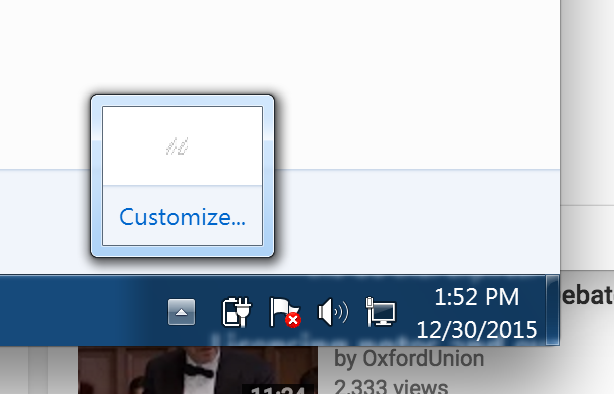
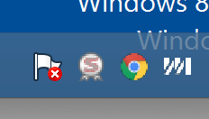

# electron-promote-windows-tray-items

When you first create an Electron [tray item][tray item] on Windows, it will show up in the toolbar
customization area:



rather than in the toolbar itself:



By default, the user must explicitly choose to show icons in the toolbar. But not only does this
create extra, potentially non-intuitive work for the user, it forces the design of icons that
will look good in both the toolbar and the customization area since you
[can't choose different icons for each location][different icons].

This package helps you skip this process. For any item in its default state, i.e. the user has not
explicitly _hid_ the item from the toolbar, this package will "promote" that item from the customization
area to the toolbar.

## Requirements

This package may be safely required on non-Windows platforms, though the package will return an error
if it is attempted to be used on non-Windows platforms.

This project is currently compatible with Electron 0.36.2 due to its dependence on
[electron-edge][electron-edge].

## Installation

For Electron:

```js
npm install electron-promote-windows-tray-items
```
or
```js
npm install electron-promote-windows-tray-items --save
```

## Usage

```js
var promoteWindowsTrayItems = require('electron-promote-windows-tray-items');

// Create a tray item.
var icon = new Tray(/* ... */);

if (process.platform === 'win32') {
  // Icon will now be in the toolbar customization area without the user explicitly toggling it to show in the toolbar.

  promoteWindowsTrayItems(function(err) {
    // Icon will now be in the toolbar itself unless the user explicitly hid it from the toolbar.
  });
}
```

## Contributing

We welcome pull requests! Please lint your code.

## Credits

Created by [Jeff Wear][Jeff Wear], with the core C# logic used by this module
[originally developed][original PR] by [Paul Betts][Paul Betts].

## Copyright and License

Copyright 2016 Mixmax, Inc., licensed under the MIT License.

Some portions derived from [Squirrel.Windows][Squirrel.Windows], copyright 2012-2016 GitHub, Inc.,
licensed under the MIT License.

[tray item]: https://github.com/atom/electron/blob/master/docs/api/tray.md
[different icons]: https://github.com/atom/electron/issues/3970
[electron-edge]: https://github.com/kexplo/electron-edge#electron-edge
[Jeff Wear]: https://github.com/wearhere
[original PR]: https://github.com/Squirrel/Squirrel.Windows/pull/447
[Paul Betts]: https://github.com/paulcbetts
[Squirrel.Windows]: https://github.com/Squirrel/Squirrel.Windows

## Release History

* 1.0.1 README fixes
* 1.0.0 Initial release.
